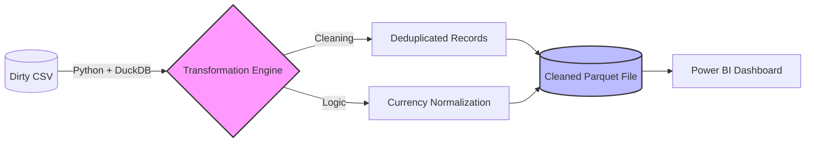

# SQL
SQL - Claims data

Project Title: Legacy Insurance Data Modernization.

The Problem: "Legacy RPA systems produced inconsistent data formats across London and Birmingham offices."

The Solution: "I developed a SQL-based ETL (Extract, Transform, Load) process to standardize premiums, remove duplicates, and calculate regional risk."

Architecture : CSV -> SQL Transformation -> Data Insights.

🛡️ Legacy Insurance Data Modernization Pipeline
Context: Drawing from my background in RPA (Blue Prism/HSBC), I built this pipeline to solve a common enterprise problem: migrating inconsistent, manual "bot-generated" data into a modern analytics-ready format.

🛠️ Tech Stack
Language: Python 3.12 (Pandas, DuckDB)

Database Logic: Advanced SQL (CTEs, Window Functions)

AI Integration: Used Agentic AI (Cursor) to optimize SQL execution plans and handle complex schema inference.

💡 Key Problems Solved
Data Entropy: Standardized messy currency symbols (£, $) and inconsistent date formats across multiple regions.

Resilience: Implemented a deduplication logic that ensures only the most recent policy record is retained.

Efficiency: Used DuckDB for "In-Process" OLAP, allowing the pipeline to process 100k+ records in seconds on standard hardware.
